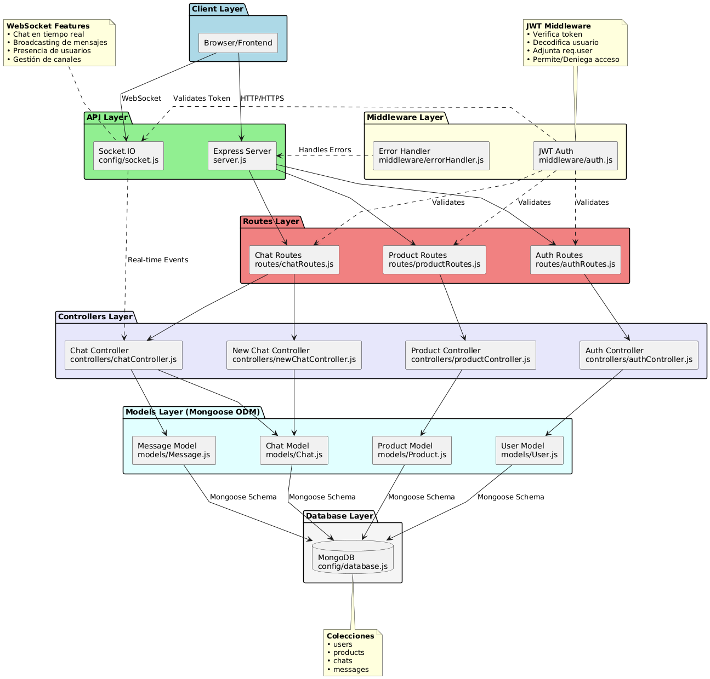

# 📋 Tabla de Contenidos
- [Descripción General](#descripción-general)
- [Arquitectura del Proyecto](#arquitectura-del-proyecto)
- [Tecnologías Utilizadas](#tecnologías-utilizadas)
- [Estructura del Proyecto](#estructura-del-proyecto)
- [Requisitos Previos](#requisitos-previos)
- [Instalación y Configuración](#instalación-y-configuración)
- [Ejecución del Proyecto](#ejecución-del-proyecto)
- [Funcionalidades](#funcionalidades)
- [Comunicación Cliente-Servidor](#comunicación-cliente-servidor)
- [Base de Datos](#base-de-datos)
- [Autenticación y Seguridad](#autenticación-y-seguridad)
- [API Endpoints](#api-endpoints)
- [GraphQL API](#graphql-api)

## 📖 Descripción General
Este proyecto es una aplicación web completa de e-commerce para una tienda de ropa que implementa funcionalidades modernas como carrito de compras persistente, sistema de órdenes, gestión de usuarios y chat en tiempo real. La aplicación está dividida en dos partes principales: un backend desarrollado con Node.js y Express que expone tanto APIs REST como GraphQL, y un frontend desarrollado con Vue.js 3.

## 🏗️ Arquitectura del Proyecto
El proyecto sigue una arquitectura Cliente-Servidor híbrida con las siguientes características:

- **Backend (REST + GraphQL)**: Servidor Node.js con Express que gestiona la lógica de negocio
  - **REST API**: Para gestión de usuarios y productos
  - **GraphQL API**: Para carrito de compras y órdenes
- **Frontend (SPA)**: Aplicación de página única con Vue.js 3
- **Comunicación en Tiempo Real**: WebSockets mediante Socket.IO para el sistema de chat
- **Base de Datos**: MongoDB para almacenamiento persistente

### Diagrama Detallado del Backend



## 🛠️ Tecnologías Utilizadas

### Backend
- **Node.js**: Entorno de ejecución de JavaScript
- **Express.js**: Framework web para Node.js
- **MongoDB**: Base de datos NoSQL
- **Mongoose**: ODM (Object Data Modeling) para MongoDB
- **Apollo Server**: Servidor GraphQL
- **GraphQL**: Lenguaje de consulta para APIs
- **Socket.IO**: Biblioteca para comunicación en tiempo real
- **JWT (JSON Web Tokens)**: Para autenticación y autorización
- **bcrypt**: Para el hash de contraseñas
- **dotenv**: Para manejo de variables de entorno

### Frontend
- **Vue.js 3**: Framework progresivo de JavaScript
- **Vite**: Herramienta de construcción y desarrollo
- **Vue Router**: Enrutamiento oficial para Vue.js
- **Pinia**: Gestión de estado (store)
- **Tailwind CSS**: Framework de CSS utility-first
- **Axios**: Cliente HTTP para peticiones REST
- **GraphQL Client**: Cliente nativo para consultas GraphQL
- **Socket.IO Client**: Cliente para WebSockets
- **ESLint**: Linter para código JavaScript
- **Prettier**: Formateador de código

## 📁 Estructura del Proyecto

### Raíz del Proyecto
```
tienda-ropa-PW1/
├── .env                    # Variables de entorno del backend
├── .gitignore             # Archivos ignorados por Git
├── package.json           # Dependencias del backend
├── README.md              # Documentación principal
├── server.js              # Punto de entrada del servidor
├── frontend/              # Aplicación Vue.js
└── src/                   # Código fuente del backend
```

### Backend (src)
```
src/
├── config/
│   ├── apollo.js          # Configuración de Apollo Server (GraphQL)
│   ├── database.js        # Configuración de conexión a MongoDB
│   └── socket.js          # Configuración de Socket.IO
├── controllers/
│   ├── adminUserController.js # Lógica de gestión de usuarios (Admin)
│   ├── authController.js      # Lógica de autenticación (login, register)
│   ├── chatController.js      # Lógica del chat
│   ├── newChatController.js   # Controlador mejorado de chat
│   └── productController.js   # Lógica de productos (CRUD)
├── graphql/
│   ├── typeDefs.js        # Definiciones de tipos GraphQL
│   └── resolvers/
│       ├── index.js       # Exportación de resolvers
│       ├── cartResolvers.js   # Resolvers del carrito
│       └── orderResolvers.js  # Resolvers de órdenes
├── middleware/
│   ├── auth.js            # Middleware de autenticación JWT (REST)
│   ├── graphqlAuth.js     # Middleware de autenticación para GraphQL
│   └── errorHandler.js    # Manejo centralizado de errores
├── models/
│   ├── Cart.js            # Modelo de carrito de compras
│   ├── Chat.js            # Modelo de conversaciones
│   ├── Message.js         # Modelo de mensajes
│   ├── Order.js           # Modelo de órdenes
│   ├── Product.js         # Modelo de productos
│   └── User.js            # Modelo de usuarios
└── routes/
    ├── adminRoutes.js     # Rutas de administración (REST)
    ├── authRoutes.js      # Rutas de autenticación (REST)
    ├── chatRoutes.js      # Rutas de chat (REST)
    └── productRoutes.js   # Rutas de productos (REST)
```

**Descripción de componentes del Backend:**

- **config/**: Contiene archivos de configuración
  - `apollo.js`: Configura Apollo Server para GraphQL
  - `database.js`: Establece la conexión con MongoDB usando Mongoose
  - `socket.js`: Configura Socket.IO para comunicación en tiempo real

- **controllers/**: Lógica de negocio de la aplicación
  - `authController.js`: Maneja registro, login y validación de usuarios
  - `productController.js`: Gestiona CRUD de productos
  - `adminUserController.js`: Gestión de usuarios por administradores
  - `chatController.js` y `newChatController.js`: Gestionan mensajes y conversaciones

- **graphql/**: API GraphQL
  - `typeDefs.js`: Define el esquema GraphQL (tipos, queries, mutations)
  - `resolvers/`: Implementa la lógica de las queries y mutations
    - `cartResolvers.js`: Gestión del carrito de compras
    - `orderResolvers.js`: Gestión de órdenes

- **middleware/**: Funciones intermedias que procesan las peticiones
  - `auth.js`: Verifica tokens JWT para rutas REST
  - `graphqlAuth.js`: Verifica tokens JWT para GraphQL
  - `errorHandler.js`: Captura y formatea errores

- **models/**: Esquemas de datos de MongoDB
  - `User.js`: Define estructura de usuarios
  - `Product.js`: Define productos
  - `Cart.js`: Define carrito de compras con items
  - `Order.js`: Define órdenes con estados y tracking
  - `Chat.js`: Define conversaciones entre usuarios
  - `Message.js`: Define mensajes individuales

- **routes/**: Definición de endpoints REST
  - `authRoutes.js`: Rutas de autenticación
  - `productRoutes.js`: Rutas de productos
  - `adminRoutes.js`: Rutas de administración de usuarios
  - `chatRoutes.js`: Rutas de chat

### Frontend (frontend)
```
frontend/
├── .env                   # Variables de entorno del frontend
├── index.html             # Punto de entrada HTML
├── package.json           # Dependencias del frontend
├── vite.config.js         # Configuración de Vite
├── tailwind.config.js     # Configuración de Tailwind CSS
├── eslint.config.js       # Configuración de ESLint
├── .prettierrc.json       # Configuración de Prettier
├── postcss.config.js      # Configuración de PostCSS
├── jsconfig.json          # Configuración de JavaScript
├── public/
│   └── favicon.ico        # Icono de la aplicación
└── src/
    ├── App.vue            # Componente raíz de Vue
    ├── main.js            # Punto de entrada de la aplicación
    ├── assets/            # Recursos estáticos (imágenes, estilos)
    │   ├── base.css
    │   └── main.css
    ├── components/        # Componentes reutilizables de Vue
    │   ├── ConfirmDialog.vue
    │   ├── Navbar.vue
    │   ├── ProductCard.vue
    │   ├── cart/
    │   │   ├── CartDrawer.vue
    │   │   └── CartItem.vue
    │   └── chat/
    │       ├── AdminChatSidebar.vue
    │       ├── ChatInput.vue
    │       ├── ChatMessages.vue
    │       └── ChatSidebar.vue
    ├── composables/       # Funciones composables de Vue 3
    │   ├── useConfirm.js
    │   └── useSocket.js
    ├── router/            # Configuración de rutas (Vue Router)
    │   └── index.js
    ├── services/          # Servicios para llamadas a la API
    │   ├── AdminOrderService.js   # Servicio de órdenes (Admin) - GraphQL
    │   ├── AdminService.js        # Servicio de productos (Admin) - REST
    │   ├── AdminUserService.js    # Servicio de usuarios (Admin) - REST
    │   ├── api.js                 # Cliente Axios base
    │   ├── auth.service.js        # Servicio de autenticación - REST
    │   ├── CartService.js         # Servicio de carrito - GraphQL
    │   ├── ChatService.js         # Servicio de chat - REST
    │   ├── OrderService.js        # Servicio de órdenes - GraphQL
    │   └── ProductService.js      # Servicio de productos - REST
    ├── stores/            # Stores de Pinia (gestión de estado)
    │   ├── adminOrder.js  # Store de órdenes (Admin)
    │   ├── auth.js        # Store de autenticación
    │   ├── cart.js        # Store del carrito
    │   ├── chat.js        # Store de chat
    │   ├── order.js       # Store de órdenes (Usuario)
    │   └── product.js     # Store de productos
    └── views/             # Vistas/páginas de la aplicación
        ├── AdminChatView.vue
        ├── AdminView.vue
        ├── CartView.vue
        ├── ChatView.vue
        ├── HomeView.vue
        ├── LoginView.vue
        ├── OrderDetailView.vue
        ├── OrdersView.vue
        ├── ProductDetailView.vue
        ├── ShopView.vue
        └── SignUpView.vue
```

**Descripción de componentes del Frontend:**

- `src/main.js`: Inicializa la aplicación Vue, configura Pinia, Router y monta la app
- `src/App.vue`: Componente principal que contiene el layout general
- `src/router/`: Define las rutas de navegación de la SPA
- `src/stores/`: Almacenes de estado global
  - Autenticación, carrito, órdenes, productos, chat
- `src/services/`: Módulos que encapsulan llamadas a APIs
  - **REST**: AdminService, AdminUserService, ChatService, ProductService
  - **GraphQL**: CartService, OrderService, AdminOrderService
- `src/views/`: Componentes de página completa
- `src/components/`: Componentes reutilizables
  - Carrito, chat, confirmaciones, navegación
- `src/composables/`: Lógica reutilizable con Composition API
  - Confirmaciones, WebSockets

## ⚙️ Funcionalidades

### 1. Gestión de Usuarios
- **Registro de usuarios**: Crear cuenta con nombre, apellido, email y contraseña
- **Inicio de sesión**: Autenticación mediante JWT
- **Perfil de usuario**: Visualizar información personal
- **Roles**: Sistema de roles (usuario, administrador)
- **Gestión de usuarios (Admin)**: 
  - Ver todos los usuarios del sistema
  - Crear nuevos usuarios con asignación de rol
  - Desactivar usuarios (soft delete)
  - Filtrar por estado (activo/inactivo) y rol
  - Estadísticas de usuarios

### 2. Catálogo de Productos
- **Listado de productos**: Visualizar todos los productos disponibles
- **Búsqueda y filtrado**: Buscar productos por categoría, precio, nombre
- **Detalle de producto**: Ver información completa, seleccionar talla y color
- **Gestión de inventario (Admin)**: 
  - Crear nuevos productos
  - Editar productos existentes
  - Eliminar productos
  - Ver estadísticas de productos
  - Ver tabla de todos los productos
- **Control de stock automático**: Productos marcados como no disponibles cuando stock = 0

### 3. Carrito de Compras (GraphQL)
- **Carrito persistente**: El carrito se guarda en la base de datos
- **Agregar productos**: Seleccionar talla, color y cantidad
- **Modificar cantidad**: Aumentar o disminuir items
- **Eliminar items**: Remover productos del carrito
- **Validación de stock**: Verificación en tiempo real
- **Cálculo automático**: Subtotal, impuestos (16%) y total
- **Drawer deslizable**: Interfaz moderna para ver el carrito
- **Persistencia entre sesiones**: El carrito se mantiene al cerrar sesión

### 4. Sistema de Órdenes (GraphQL)
- **Crear órdenes**: Convertir carrito en orden con un clic
- **Estados de orden**:
  - **En curso**: Orden recién creada
  - **Completada**: Orden entregada (solo Admin puede marcar)
  - **Cancelada**: Usuario o Admin puede cancelar
- **Ver historial de órdenes**: Lista de todas las órdenes del usuario
- **Detalle de orden**: Ver items, totales, estado y fechas
- **Cancelar orden**: Usuario puede cancelar órdenes no completadas
- **Número de orden único**: Generación automática de número de tracking
- **Restauración de stock**: Stock se restaura al cancelar orden
- **Gestión de órdenes (Admin)**:
  - Ver todas las órdenes de todos los usuarios
  - Filtrar por estado (en-curso, completada, cancelada)
  - Marcar órdenes como completadas
  - Cancelar órdenes con motivo
  - Ver estadísticas de órdenes y revenue

### 5. Sistema de Chat en Tiempo Real
- **Canales de chat**: Múltiples canales (Orders, Customer Support, Admin, Shipping)
- **Chat en tiempo real**: Usando Socket.IO
- **Historial de mensajes**: Persistencia en MongoDB
- **Indicador de escritura**: "User is typing..." en tiempo real
- **Mensajes no leídos**: Contadores de mensajes sin leer
- **Vista de administrador**: Panel para gestionar todos los chats
- **Estado de chat**: Activo o cerrado

## 🔄 Comunicación Cliente-Servidor

### 1. REST API (Axios)
Usado para:
- Autenticación (login, registro)
- Gestión de productos (CRUD)
- Gestión de usuarios (Admin)
- Sistema de chat

### 2. GraphQL API (Apollo Server)
Usado para:
- **Carrito de compras**: Queries y mutations para gestionar el carrito
- **Órdenes**: Crear, consultar, cancelar y completar órdenes

```graphql
# Ejemplos de Queries
query {
  myCart {
    items {
      producto { nombre precio }
      cantidad
      subtotal
    }
    total
  }
}

query {
  myOrders {
    numeroOrden
    total
    estado
    fechaOrden
  }
}

# Ejemplos de Mutations
mutation {
  addToCart(input: {
    productoId: "..."
    cantidad: 2
    talla: "M"
    color: "Negro"
  }) {
    items { ... }
  }
}

mutation {
  createOrder {
    numeroOrden
    total
  }
}
```

### 3. WebSocket (Socket.IO)
Para comunicación en tiempo real en el chat:
- Eventos: `join-channel`, `send-message`, `typing`, `stop-typing`
- Notificaciones instantáneas de nuevos mensajes

## 🗄️ Base de Datos

### MongoDB - Colecciones

#### Users
```javascript
{
  _id: ObjectId,
  nombre: String,
  apellido: String,
  email: String (unique),
  password: String (hashed),
  rol: String (enum: ['usuario', 'administrador']),
  activo: Boolean,
  createdAt: Date,
  updatedAt: Date
}
```

#### Products
```javascript
{
  _id: ObjectId,
  nombre: String,
  descripcion: String,
  precio: Number,
  categoria: String,
  tallas: [String],
  colores: [String],
  stock: Number,
  imagen: String,
  disponible: Boolean,
  createdBy: ObjectId (ref: User),
  createdAt: Date,
  updatedAt: Date
}
```

#### Carts
```javascript
{
  _id: ObjectId,
  usuario: ObjectId (ref: User, unique),
  items: [{
    producto: ObjectId (ref: Product),
    cantidad: Number,
    talla: String,
    color: String,
    precioUnitario: Number
  }],
  total: Number,
  activo: Boolean,
  createdAt: Date,
  updatedAt: Date
}
```

#### Orders
```javascript
{
  _id: ObjectId,
  usuario: ObjectId (ref: User),
  numeroOrden: String (unique),
  items: [{
    producto: ObjectId (ref: Product),
    nombre: String,
    imagen: String,
    cantidad: Number,
    talla: String,
    color: String,
    precioUnitario: Number,
    subtotal: Number
  }],
  subtotal: Number,
  impuestos: Number,
  total: Number,
  estado: String (enum: ['en-curso', 'completada', 'cancelada']),
  fechaOrden: Date,
  fechaCompletada: Date,
  fechaCancelada: Date,
  motivoCancelacion: String,
  createdAt: Date,
  updatedAt: Date
}
```

#### Chats
```javascript
{
  _id: ObjectId,
  channel: String (enum: ['orders', 'customer-support', 'admin', 'shipping']),
  channelName: String,
  user: ObjectId (ref: User),
  status: String (enum: ['active', 'closed']),
  messages: [{
    sender: ObjectId (ref: User),
    senderType: String (enum: ['user', 'admin']),
    content: String,
    read: Boolean,
    createdAt: Date
  }],
  lastMessage: Date,
  unreadCount: {
    user: Number,
    admin: Number
  },
  createdAt: Date,
  updatedAt: Date
}
```

## 🔐 Autenticación y Seguridad

### Flujo de Autenticación
1. Usuario envía credenciales a `/api/auth/login` o `/api/auth/register`
2. El `authController.js` valida las credenciales
3. Si son correctas, genera un JWT con el payload del usuario
4. El token se devuelve al cliente
5. El cliente almacena el token en `localStorage`
6. En cada petición:
   - **REST**: Token en header `Authorization: Bearer <token>`
   - **GraphQL**: Token en header `Authorization: Bearer <token>`
   - **WebSocket**: Token enviado en handshake
7. Los middlewares verifican el token antes de permitir acceso

### Seguridad Implementada
- **Bcrypt**: Hash de contraseñas (10 rounds)
- **JWT**: Tokens firmados con clave secreta
- **Middleware de autenticación**: 
  - `auth.js` para REST
  - `graphqlAuth.js` para GraphQL
- **Autorización por rol**: Rutas específicas para administradores
- **CORS**: Configuración para peticiones de origen cruzado
- **Validación de datos**: Sanitización de inputs
- **Soft delete**: Desactivación de usuarios en lugar de eliminación
- **Protección de operaciones sensibles**: 
  - Admin no puede eliminarse a sí mismo
  - Validación de stock antes de crear órdenes
  - Verificación de propiedad de recursos

## 🛣️ API Endpoints

### REST API

#### Autenticación (`/api/auth`)
- `POST /register` - Registrar nuevo usuario
- `POST /login` - Iniciar sesión
- `GET /me` - Obtener usuario actual (protegida)

#### Productos (`/api/products`)
- `GET /` - Listar todos los productos (protegida)
- `GET /:id` - Obtener producto por ID (protegida)
- `POST /` - Crear producto (Admin)
- `PUT /:id` - Actualizar producto (Admin)
- `DELETE /:id` - Eliminar producto (Admin)
- `GET /stats/overview` - Estadísticas de productos (Admin)
- `GET /stats/table` - Tabla de productos (Admin)

#### Gestión de Usuarios Admin (`/api/admin`)
- `GET /users` - Listar todos los usuarios (Admin)
- `GET /users/stats` - Estadísticas de usuarios (Admin)
- `GET /users/:id` - Obtener usuario por ID (Admin)
- `POST /users` - Crear nuevo usuario (Admin)
- `DELETE /users/:id` - Desactivar usuario (Admin)

#### Chat (`/api/chats`)
- `GET /my-chats` - Obtener chats del usuario (protegida)
- `GET /:channel` - Obtener o crear chat por canal (protegida)
- `POST /:channel/message` - Enviar mensaje (protegida)
- `PUT /:channel/read` - Marcar como leído (protegida)
- `PUT /:channel/close` - Cerrar chat (protegida)
- `GET /admin/all` - Obtener todos los chats (Admin)
- `GET /admin/:userId/:channel` - Obtener chat específico (Admin)

### GraphQL API (`/graphql`)

#### Queries

**Carrito**
```graphql
# Obtener mi carrito
myCart: Cart

# Obtener carrito por ID (Admin)
cart(id: ID!): Cart
```

**Órdenes**
```graphql
# Obtener mis órdenes
myOrders: [Order!]!

# Obtener orden por ID
order(id: ID!): Order

# Obtener orden por número
orderByNumber(numeroOrden: String!): Order

# Obtener todas las órdenes (Admin)
allOrders(estado: String): [Order!]!
```

#### Mutations

**Carrito**
```graphql
# Agregar al carrito
addToCart(input: AddToCartInput!): Cart!

# Actualizar cantidad de item
updateCartItem(input: UpdateCartItemInput!): Cart!

# Remover item del carrito
removeFromCart(itemId: ID!): Cart!

# Limpiar carrito
clearCart: Cart!
```

**Órdenes**
```graphql
# Crear orden desde el carrito
createOrder: Order!

# Cancelar orden
cancelOrder(input: CancelOrderInput!): Order!

# Completar orden (Admin)
completeOrder(orderId: ID!): Order!
```

## 📦 Requisitos Previos

Antes de comenzar, asegúrate de tener instalado:

- **Node.js** (versión 16 o superior) - [Descargar Node.js](https://nodejs.org/)
- **npm** o **yarn** (viene con Node.js)
- **MongoDB** (versión 5.0 o superior) - [Descargar MongoDB](https://www.mongodb.com/try/download/community)
- **Git** - [Descargar Git](https://git-scm.com/)

Verifica las instalaciones ejecutando:
```bash
node --version
npm --version
mongod --version
```

## 🚀 Instalación y Configuración

### 1. Clonar el Repositorio

```bash
git clone <repository-url>
cd tienda-ropa-PW1
```

### 2. Configurar el Backend

#### Instalar dependencias del backend
```bash
npm install
```

#### Configurar variables de entorno
Crea un archivo `.env` en la raíz del proyecto con el siguiente contenido:

```env
# Puerto del servidor
PORT=3000

# URL de conexión a MongoDB
MONGODB_URI=mongodb://localhost:27017/tienda-ropa

# Clave secreta para JWT (generar una aleatoria)
JWT_SECRET=tu_clave_secreta_muy_segura_aqui

# Entorno de ejecución
NODE_ENV=development

# URL del frontend (para CORS)
FRONTEND_URL=http://localhost:5173
```

### 3. Configurar el Frontend

#### Navegar a la carpeta del frontend
```bash
cd frontend
```

#### Instalar dependencias del frontend
```bash
npm install
```

#### Configurar variables de entorno del frontend
Crea un archivo `.env` en la carpeta `frontend/` con:

```env
# URL del backend API (sin /api)
VITE_API_URL=http://localhost:3000/api

# URL del servidor Socket.IO
VITE_SOCKET_URL=http://localhost:3000
```

### 4. Iniciar MongoDB

Asegúrate de que MongoDB esté ejecutándose:

#### En Windows:
```bash
mongod
```

#### En macOS/Linux:
```bash
sudo systemctl start mongod
# o
brew services start mongodb-community
```

Para verificar que MongoDB está corriendo:
```bash
mongosh
```

## ▶️ Ejecución del Proyecto

### Opción 1: Ejecución Manual (Desarrollo)

#### Terminal 1 - Backend:
```bash
# Desde la raíz del proyecto
npm run dev
```
El servidor backend estará disponible en:
- REST API: `http://localhost:3000/api`
- GraphQL: `http://localhost:3000/graphql`
- GraphQL Playground: `http://localhost:3000/graphql` (en navegador)

#### Terminal 2 - Frontend:
```bash
# Desde la raíz del proyecto
cd frontend
npm run dev
```
El frontend estará disponible en `http://localhost:5173`

### Opción 2: Ejecución Concurrente (Recomendado)

Si tienes configurado un script concurrente en el package.json raíz:

```bash
npm run dev:all
```

Esto iniciará tanto el backend como el frontend simultáneamente.

## 🧪 Uso del Proyecto

### 1. Acceder a la Aplicación

Abre tu navegador y visita:
```
http://localhost:5173
```

### 2. Probar con Usuario Administrador

Para probar funcionalidades de administrador:

- **Email**: `admin@example.com`
- **Contraseña**: `admin123`

### 3. Crear un Nuevo Usuario

1. Haz clic en "Sign Up"
2. Completa el formulario con:
   - Nombre
   - Apellido
   - Email válido
   - Contraseña (mínimo 6 caracteres)
3. Haz clic en "Create Account"

### 4. Funcionalidades Disponibles

#### Como Usuario:
- ✅ Navegar por el catálogo de productos
- ✅ Buscar y filtrar productos
- ✅ Ver detalles de productos
- ✅ Agregar productos al carrito
- ✅ Modificar cantidad de items en el carrito
- ✅ Ver carrito en drawer deslizable
- ✅ Crear órdenes desde el carrito
- ✅ Ver historial de órdenes
- ✅ Ver detalle de cada orden
- ✅ Cancelar órdenes no completadas
- ✅ Iniciar conversaciones de chat en múltiples canales
- ✅ Enviar mensajes en tiempo real
- ✅ Ver indicador de "escribiendo..."
- ✅ Ver mensajes no leídos

#### Como Administrador:
- ✅ Todas las funcionalidades de usuario
- ✅ **Gestión de Productos**:
  - Crear nuevos productos
  - Editar productos existentes
  - Eliminar productos
  - Ver estadísticas de productos
  - Ver tabla de todos los productos
- ✅ **Gestión de Órdenes**:
  - Ver todas las órdenes de todos los usuarios
  - Filtrar órdenes por estado
  - Marcar órdenes como completadas
  - Cancelar órdenes con motivo
  - Ver estadísticas de órdenes
  - Ver detalles completos de cada orden
- ✅ **Gestión de Usuarios**:
  - Ver todos los usuarios del sistema
  - Crear nuevos usuarios
  - Asignar roles (usuario/administrador)
  - Desactivar usuarios
  - Filtrar usuarios por estado y rol
  - Ver estadísticas de usuarios
- ✅ **Gestión de Chats**:
  - Ver todos los chats de todos los usuarios
  - Responder mensajes en tiempo real
  - Marcar mensajes como leídos
  - Ver indicador de "escribiendo..."

### 5. Probar el Carrito y Órdenes

1. Navega al catálogo de productos
2. Selecciona un producto
3. Elige talla, color y cantidad
4. Agrega al carrito
5. Haz clic en el icono del carrito (parte superior derecha)
6. Modifica cantidades si lo deseas
7. Haz clic en "Place Order"
8. Navega a "Orders" en el navbar
9. Ve tus órdenes y sus detalles

### 6. Probar el Chat en Tiempo Real

1. Como usuario, haz clic en el icono de chat
2. Selecciona un canal (Orders, Customer Support, etc.)
3. Envía un mensaje
4. En otra ventana, inicia sesión como administrador
5. Ve a "Admin Chat"
6. Responde al mensaje del usuario
7. Observa las actualizaciones en tiempo real en ambas ventanas

## 🔧 Scripts Disponibles

### Backend (raíz del proyecto)
```bash
npm start          # Inicia el servidor en modo producción
npm run dev        # Inicia el servidor en modo desarrollo (con nodemon)
```

### Frontend (carpeta frontend/)
```bash
npm run dev        # Inicia el servidor de desarrollo de Vite
npm run build      # Construye la aplicación para producción
npm run preview    # Previsualiza la build de producción
npm run lint       # Ejecuta ESLint
npm run format     # Formatea el código con Prettier
```

## 📝 Notas Adicionales

### Desarrollo
- El proyecto usa ES Modules en el backend
- El frontend está configurado con Hot Module Replacement (HMR)
- Se incluyen configuraciones de ESLint y Prettier
- El archivo `.gitignore` excluye `node_modules`, `.env` y archivos de build

### Arquitectura Híbrida
- **REST API**: Usado para operaciones tradicionales CRUD y autenticación
- **GraphQL API**: Usado para operaciones complejas de carrito y órdenes
- Esta combinación permite:
  - Simplicidad de REST para operaciones básicas
  - Flexibilidad de GraphQL para queries complejas
  - Mejor rendimiento en el carrito (menos peticiones)

### Base de Datos
- MongoDB almacena toda la información de forma persistente
- El carrito se sincroniza con la BD en cada operación
- Las órdenes mantienen snapshot de los productos al momento de la compra
- Los chats persisten todo el historial de mensajes

### Seguridad
- Todos los endpoints protegidos requieren autenticación
- Las operaciones de administrador requieren rol específico
- Los tokens JWT expiran (configurable en `JWT_SECRET`)
- Las contraseñas nunca se almacenan en texto plano
- El stock se valida antes de cada operación

## 🐛 Solución de Problemas

### Error: "MongoDB no está ejecutándose"
```bash
# Verificar estado de MongoDB
mongosh

# Si no funciona, iniciar MongoDB
# Windows:
mongod

# Linux/Mac:
sudo systemctl start mongod
```

### Error: "Puerto ya en uso"
Si el puerto 3000 o 5173 ya está en uso:

1. Cambia el puerto en `.env` (backend) o `vite.config.js` (frontend)
2. O detén el proceso que usa el puerto:
```bash
# Linux/Mac
lsof -i :3000
kill -9 <PID>

# Windows
netstat -ano | findstr :3000
taskkill /PID <PID> /F
```

### Error: "Cannot find module"
Reinstala las dependencias:
```bash
# Backend
rm -rf node_modules package-lock.json
npm install

# Frontend
cd frontend
rm -rf node_modules package-lock.json
npm install
```

### GraphQL Errors
Si ves errores GraphQL:
1. Verifica que el token JWT sea válido
2. Revisa la estructura de tus queries/mutations
3. Consulta el schema en GraphQL Playground
4. Revisa los logs del servidor backend

## Usuario Administrador para Pruebas

**Email**: `admin@example.com`  
**Contraseña**: `admin123`

---

